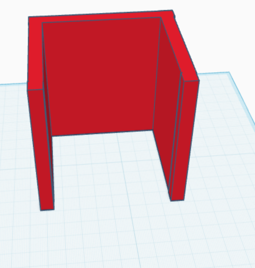
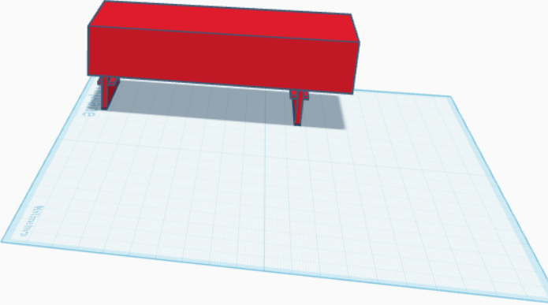

# Viraaj's Hexapod Robot
The Hexapod is a robotic creature designed with six legs that recreate the walking motion of a spider. It is a programmable robot that allows me to build and customize my own Hexapod robot. The Hexapod’s body is made of acrylic material. Each leg consists of three servo motors and this helps get precise movement. The Hexapod is powered by an Arduino mega or mega 2560, which serves as the brain of the robot, controlling its actions and receiving input from the wireless transciever module. It also has a controller that is the main thing that lets it move. The hexapod for me is a fun project that lets you modify it to become even more intriguing.


| **Engineer** | **School** | **Area of Interest** | **Grade** |
|:--:|:--:|:--:|:--:|
| Viraaj P | Stuart Hall For Boys | Mechanical/robotic engineering | Incoming 7th grader


  
# Final Milestone


<iframe width="560" height="315" src="https://www.youtube.com/embed/XuwWDlP9Ilw?si=Tjy6VWH0GvB65OKy" title="YouTube video player" frameborder="0" allow="accelerometer; autoplay; clipboard-write; encrypted-media; gyroscope; picture-in-picture; web-share" referrerpolicy="strict-origin-when-cross-origin" allowfullscreen></iframe>


For my final milestone, I got the speaker to work through the 3d printed basketball head. I got to learn python while coding the speaker which was a really big accomplishment for me. During this, I realized that every time I turned my hexapod on, the battery drained drastically. This was because my processing IDE code was downloaded wrong. I had to completely uninstall processing and reinstall it to get the battery to work. I also realized that 3 of my servo horns were very worn out and I had to get new ones to fix it. Without doing this, even when my battery was on, I could move the 3 servos with my hand when they are supposed to stay in place. At the end of my milestone, my basketball shaped head prevented my hexapod legs from moving. I needed to redesign the head and add stands to my battery pack to not let it touch the wires. Overall, the challenges from this project really inspired me to keep moving even when you have to take your whole project apart.

My time at Bluestamp has taught me


# Second Milestone


<iframe width="560" height="315" src="https://www.youtube.com/embed/rxW5v5EISyE?si=iVrA0GKTdf82Tdoz" title="YouTube video player" frameborder="0" allow="accelerometer; autoplay; clipboard-write; encrypted-media; gyroscope; picture-in-picture; web-share" referrerpolicy="strict-origin-when-cross-origin" allowfullscreen></iframe>

For my second milestone, I finished the whole robot. I added the remote, the WLAN module, and the transceiver wireless module. What the wireless module does is that there is 1 on the remote, and 1 on the arduino. The one on the remote sends a frequency wave to the arduino one which makes the motors move with it. When the hexapod turns on, the frequency wave from the remote sends signals to the arduino allowing the movement. The acrylic plate was used to extend the controller to allow for the battery for it to be placed on. Some challenges I faced when doing this was that my remote could connect to everyone elses exept mine. This was because the address for all of our robots were the same. I changed the address by changing the code * see next line*.robot.setRemote(byte byte0, ....,byte byte04) and then set the remote to the same address, remote.Set(byte byte0, ...., byte byte05). There are 5 bytes in each module. Once this was changed, my remote worked for my hexapod. In my final milestone, I will 3d print a battery holder and I will create a head to put it in. This basketball shaped head will have a speaker inside and it will say commands like, cross, between, behind, defense! 

# First Milestone


<iframe width="560" height="315" src="https://www.youtube.com/embed/801dQZTHeT4?si=0_psskIZ3us-BxwH" title="YouTube video player" frameborder="0" allow="accelerometer; autoplay; clipboard-write; encrypted-media; gyroscope; picture-in-picture; web-share" referrerpolicy="strict-origin-when-cross-origin" allowfullscreen></iframe>


For my first milestone, I finished the chassis of my hexapod and now it works from my computer. I first screwed in the hors to the top chassis, then to the legs, and then to the feet. Next, I put 2 motors together to create the"hips". Following that, I screwed on the hips and had to make sure all of them were at 90 degrees. After that came the legs and then the feet. On my first attempt, the motors were not at 90 degrees. But after that, I carefully screwed them all in and it turned on perfectly. Some major issues that I faced was when I was assembling the hexapod was that I put all the servo horns flipped incorrectly. Due to this, I had to redo all of the screwing. This took 1 day but was a hassle. Next, because we couldnt use lithuim batterys, I could've  desoldered the battery chassis or connect a new battery source to it. I chose to connect a new 7.5 volt battery to it. It was very hard to make small solders for 2 wires but in the end I got it to work. I did this by getting both wires ready, placed the soldering iron on the solder, melted it, and while it was melted I placed both wires in it and it hardened up and worked. After the small screws, all the other screws were much easier to screw in with the nuts. For my calibration, my angles were off by 10 so I had to re calibrate it and now when I turn it on the whole robot goes to 90 degrees.


# Schematics 
These are my 3d printed designs. The second photo is my battery pack and the first one is my hexapod head. The head amplifies the speaker because the speaker needs a hollow object for you to hear sound.               


 

# Code 

```c++

//Remote Code
#ifndef ARDUINO_AVR_UNO
#error Wrong board. Please choose "Arduino/Genuino Uno"
#endif

// Include FNHR (Freenove Hexapod Robot) library
#include <FNHR.h>

FNHRRemote remote;

void setup() {
  // Start remote
  remote.Start();
}

void loop() {
  // Update remote
  remote.Update();
}

```
```c++
//Hexapod code
#ifndef ARDUINO_AVR_MEGA2560
#error Wrong board. Please choose "Arduino/Genuino Mega or Mega 2560"
#endif

// Include FNHR (Freenove Hexapod Robot) library
#include <FNHR.h>

FNHR robot;

void setup() {
  // Start Freenove Hexapod Robot with default function
  robot.Start(true);
}

void loop() {
  // Update Freenove Hexapod Robot
  robot.Update();
}

```
```c++
void RobotAction::GetCrawlPoints(RobotLegsPoints & points, Point point)
{
  GetCrawlPoint(points.leg1, point);
  GetCrawlPoint(points.leg2, point);
  GetCrawlPoint(points.leg3, point);
  GetCrawlPoint(points.leg4, point);
  GetCrawlPoint(points.leg5, point);
  GetCrawlPoint(points.leg6, point);
}

void RobotAction::GetCrawlPoint(Point & point, Point direction)
{
  point = Point(point.x + direction.x, point.y + direction.y, point.z + direction.z);
}

void RobotAction::GetTurnPoints(RobotLegsPoints & points, float angle)
{
  GetTurnPoint(points.leg1, angle);
  GetTurnPoint(points.leg2, angle);
  GetTurnPoint(points.leg3, angle);
  GetTurnPoint(points.leg4, angle);
  GetTurnPoint(points.leg5, angle);
  GetTurnPoint(points.leg6, angle);
}

void RobotAction::GetTurnPoint(Point & point, float angle)
{
  float radian = angle * PI / 180;
  float radius = sqrt(pow(point.x, 2) + pow(point.y, 2));

  float x = radius * cos(atan2(point.y, point.x) + radian);
  float y = radius * sin(atan2(point.y, point.x) + radian);

  point = Point(x, y, point.z);
}

void RobotAction::TwistBody(Point move, Point rotateAxis, float rotateAngle)
{
  ActionState();
  if (legsState != LegsState::TwistBodyState)
    InitialState();

  RobotLegsPoints points = lastChangeLegsStatePoints;
  points.leg1.z = -defaultBodyLift;
  points.leg2.z = -defaultBodyLift;
  points.leg3.z = -defaultBodyLift;
  points.leg4.z = -defaultBodyLift;
  points.leg5.z = -defaultBodyLift;
  points.leg6.z = -defaultBodyLift;

  // move body
  move.x = constrain(move.x, -30, 30);
  move.y = constrain(move.y, -30, 30);
  move.z = constrain(move.z, 0, 45);
  GetMoveBodyPoints(points, move);

  // rotate body
  rotateAngle = constrain(rotateAngle, -15, 15);
  GetRotateBodyPoints(points, rotateAxis, rotateAngle);

  LegsMoveTo(points, speedTwistBody);

  legsState = LegsState::TwistBodyState;
}

void RobotAction::GetMoveBodyPoints(RobotLegsPoints & points, Point point)
{
  GetMoveBodyPoint(points.leg1, point);
  GetMoveBodyPoint(points.leg2, point);
  GetMoveBodyPoint(points.leg3, point);
  GetMoveBodyPoint(points.leg4, point);
  GetMoveBodyPoint(points.leg5, point);
  GetMoveBodyPoint(points.leg6, point);
}

void RobotAction::GetMoveBodyPoint(Point & point, Point direction)
{
  point = Point(point.x - direction.x, point.y - direction.y, point.z - direction.z);
}

void RobotAction::GetRotateBodyPoints(RobotLegsPoints &points, Point rotateAxis, float rotateAngle)
{
  float rotateAxisLength = sqrt(pow(rotateAxis.x, 2) + pow(rotateAxis.y, 2) + pow(rotateAxis.z, 2));
  if (rotateAxisLength == 0)
  {
    rotateAxis.x = 0;
    rotateAxis.y = 0;
    rotateAxis.z = 1;
  }
  else
  {
    rotateAxis.x /= rotateAxisLength;
    rotateAxis.y /= rotateAxisLength;
    rotateAxis.z /= rotateAxisLength;
  }

  GetRotateBodyPoint(points.leg1, rotateAxis, rotateAngle);
  GetRotateBodyPoint(points.leg2, rotateAxis, rotateAngle);
  GetRotateBodyPoint(points.leg3, rotateAxis, rotateAngle);
  GetRotateBodyPoint(points.leg4, rotateAxis, rotateAngle);
  GetRotateBodyPoint(points.leg5, rotateAxis, rotateAngle);
  GetRotateBodyPoint(points.leg6, rotateAxis, rotateAngle);
}

void RobotAction::GetRotateBodyPoint(Point & point, Point rotateAxis, float rotateAngle)
{
  Point oldPoint = point;

  rotateAngle = rotateAngle * PI / 180;
  float c = cos(rotateAngle);
  float s = sin(rotateAngle);

  point.x = (rotateAxis.x * rotateAxis.x * (1 - c) + c) * oldPoint.x + (rotateAxis.x * rotateAxis.y * (1 - c) - rotateAxis.z * s) * oldPoint.y + (rotateAxis.x * rotateAxis.z * (1 - c) + rotateAxis.y * s) * oldPoint.z;
  point.y = (rotateAxis.y * rotateAxis.x * (1 - c) + rotateAxis.z * s) * oldPoint.x + (rotateAxis.y * rotateAxis.y * (1 - c) + c) * oldPoint.y + (rotateAxis.y * rotateAxis.z * (1 - c) - rotateAxis.x * s) * oldPoint.z;
  point.z = (rotateAxis.x * rotateAxis.z * (1 - c) - rotateAxis.y * s) * oldPoint.x + (rotateAxis.y * rotateAxis.z * (1 - c) + rotateAxis.x * s) * oldPoint.y + (rotateAxis.z * rotateAxis.z * (1 - c) + c) * oldPoint.z;
}

void RobotAction::LegsMoveTo(RobotLegsPoints points)
{
  if (!robot.CheckPoints(points))
    return;

  robot.MoveTo(points);
  robot.WaitUntilFree();
}

void RobotAction::LegsMoveTo(RobotLegsPoints points, float speed)
{
  if (!robot.CheckPoints(points))
    return;

  robot.SetSpeed(speed);
  robot.MoveTo(points);
  robot.WaitUntilFree();
}

void RobotAction::LegsMoveTo(RobotLegsPoints points, int leg, float legSpeed)
{
  if (!robot.CheckPoints(points))
    return;

  float distance[6] = {
    Point::GetDistance(robot.leg1.pointNow, points.leg1),
    Point::GetDistance(robot.leg2.pointNow, points.leg2),
    Point::GetDistance(robot.leg3.pointNow, points.leg3),
    Point::GetDistance(robot.leg4.pointNow, points.leg4),
    Point::GetDistance(robot.leg5.pointNow, points.leg5),
    Point::GetDistance(robot.leg6.pointNow, points.leg6) };

  float speed[6] = {
    distance[0] / distance[leg - 1] * legSpeed,
    distance[1] / distance[leg - 1] * legSpeed,
    distance[2] / distance[leg - 1] * legSpeed,
    distance[3] / distance[leg - 1] * legSpeed,
    distance[4] / distance[leg - 1] * legSpeed,
    distance[5] / distance[leg - 1] * legSpeed };

  robot.SetSpeed(speed[0], speed[1], speed[2], speed[3], speed[4], speed[5]);
  robot.MoveTo(points);
  robot.WaitUntilFree();
}

void RobotAction::LegsMoveToRelatively(Point point, float speed)
{
  RobotLegsPoints points;

  robot.GetPointsNow(points);
  GetCrawlPoints(points, point);

  LegsMoveTo(points, speed);
}

#endif
```
now this is the code in python that makes the speaker work
```c++
from playsound3 import playsound
import random
import time

files = [
"Recording (6).m4a",
"Recording (7).m4a",
"Recording (8).m4a",
"Recording (9).m4a",
"Recording (10).m4a",
"Recording (11).m4a",
"Recording (13).m4a",
"Recording (12).m4a"
]

print("Starting the Humbird speaker")
time.sleep(3)

while True:
    try:
        randomAudio = random.choice(files)
        print(f"Now playing a random sound: {randomAudio}")

        playsound(randomAudio)

        print("Finished playing sound, now resting...")
        time.sleep(4)

    except KeyboardInterrupt:
        print("Interrupted by user, exiting...")
        break

    except Exception as e:
        print(f"Bluetooth interrupted: {e}")
        time.sleep(5)
```


# Bill of Materials
This is the Bill Of Materials for the main parts for the hexapod

| **Part** | **Note** | **Price** | **Link** |
|:--:|:--:|:--:|:--:|
| WLAN module| This is used to connect the hexapod to your phone or controller| $6.59 | <a href="https://www.amazon.com/DIYmall-ESP8266-ESP-01S-Serial-Transceiver/dp/B00O34AGSU/"> Link </a>|
| Wireless transceiver module(2)| used for sending signals from the remote to the hexapod to make it move | $8.86 |<a href="https://www.amazon.com/KEAcvise-4-Pack-NRF24L01-2-4GHz-Transceiver/dp/B0F93YYN9B/"> Link </a> |
| crawling remote controller | used to control all of the motors | only sold with hexapod |<a href= "https://www.amazon.com/Freenove-Raspberry-Crawling-Detailed-Tutorial/dp/B07FLVZ2DN?th=1/"> Link </a> |
| servo motors(18) | used for moving the legs or the whole robot | $21.39 | <a href="https://www.amazon.com/KEAcvise-Packs-mg996r-servo-Motor/dp/B0FGP9ZPJN/"> Link </a> |
| remote control spider shield | one of the parts used for the remote control to make the hexapod move without connecting to your computer | only sold with hexapod |<a href= "https://www.amazon.com/Freenove-Raspberry-Crawling-Detailed-Tutorial/dp/B07FLVZ2DN?th=1/"> Link </a> |
| arduino uno(2) | one is used for the controller the other is used for my modifications | $14.99 |<a href="https://www.amazon.com/ELEGOO-Board-ATmega328P-ATMEGA16U2-Compliant/dp/B01EWOE0UU/"> Link </a> |

# Other Resources/Examples

Thank you for viewing my portfolio on my hexapod
:)
